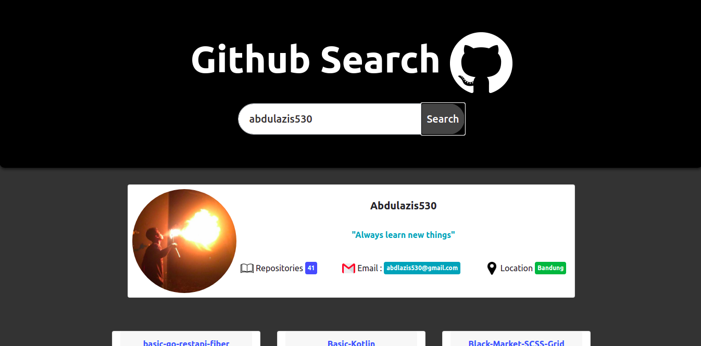
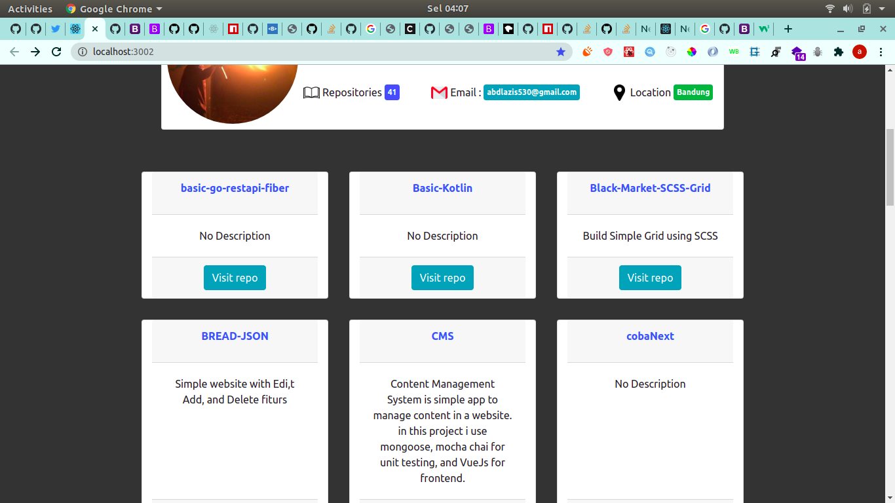
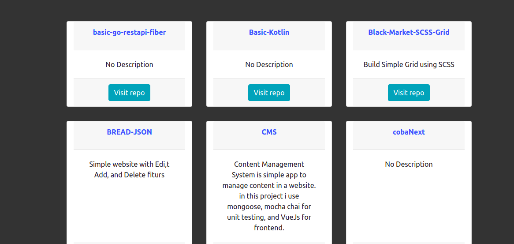

# Documentation

### Packages I used in this project

| `Packages`          |
| ------------------- | 
| `Redux`             |
| `Redux Thunk`       | 
| `React Strap`       |
| `Bootsrap`          | 

## Getting Started

Open this folder and install node modules 

```
$cd mytens-fe-test
$npm install or $yarn install
```

run the application

```
$npm start or $yarn start

```

Application is running!

## DISPLAY

## Display 1



## Display 2



## Display 3



